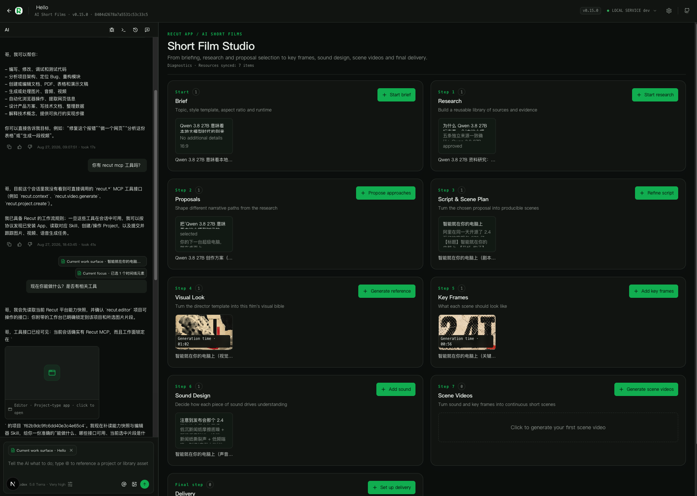

<div align="center">


# AI 短片 · AI Short Film

**把一个选题做成可研究、可审阅、可继续生产的 AI 短片**

资料 → 方案 → 剧本 → 镜头 → 成片，带确认闸门的线性工作流

[中文](./README.md) · [English](./README.en.md)

</div>



## 这是什么

AI 短片是 Recut 的**叙事短片 App**（`project` 类型）。它不做一键黑盒成片，而是把一个选题按**立项 → 资料研究 → 创作方案 → 剧本与场景方案 → 视觉设定 → 关键画面 → 声音设计 → 场景视频 → 成片交付**的线性流程推进，每一步都可审阅、可回退。

- **资料可复用**：文章、YouTube、小红书、抖音和网页先登记为全局 `reference` 素材（正文、图片字节与平台元数据完整保存），项目只存 `assetId` 与研究结论。
- **人做关键决策**：资料是否足够需用户确认（`research.approve`），创作方案需用户选定（`proposal.select`）。
- **结果可继续生产**：成片交付为确定性导出，`film.package` 再发布含剧本、风格与素材 ID 的交接包供 Remotion 等 App 继续编排。

> 随 Recut 安装使用。发布于 [6174/recut-ai-short-film](https://github.com/6174/recut-ai-short-film)。三套导演风格模板：`editorial-vox` / `hand-drawn-essay` / `animated-character`。

## 为什么用它

### 资料先行，叙事有据

先建立研究资料库再谈创意；剧本场景可引用资料素材，避免空口叙事。

### 风格被冻结，一致性可控

立项时冻结风格模板、画幅与时长，模板含参考图提示与导演叙事方法，后续镜头保持一致。

### 每一步都是交付物

资料、方案、剧本、镜头各自独立，不通过“依赖 section”耦合；`workflow.context` 只给出唯一允许的下一步，复杂判断交给 Agent。

## 从想法到成片

1. **立项**（`brief.create`）：填写选题、风格模板、画幅与预期时长。
2. **资料研究**（`resource.create: research`）：检索多源资料，每条先 `recut.media.create_reference` 登记为全局素材。
3. **确认资料**（`research.approve`）→ **创作方案**（`proposals`）→ **选定方案**（`proposal.select`）。
4. **剧本与场景方案 → 视觉设定 → 关键画面 → 声音设计 → 场景视频**：逐段生成与审阅，默认每次只做下一段 Scene。
5. **成片交付**（`delivery.export`）与 **交接包**（`film.package`）：确定性导出成片，发布可复用交接产物。

## 核心能力

| 能力 | 你能做什么 | 关键操作 |
| --- | --- | --- |
| **立项与上下文** | 冻结选题/风格/画幅/时长，读取唯一下一步与阶段契约 | `brief.create` · `workflow.context` |
| **资料研究** | 登记全局 reference 素材，保存研究结论 | `recut.media.create_reference` → `resource.create: research` · `research.approve` |
| **方案与剧本** | 多方案对比选定，细化为约 5 秒场景计划 | `resource.create: proposals/script` · `proposal.select` |
| **镜头与声音** | 视觉设定、关键画面、声音设计、场景视频分步生成 | `resource.create: look/keyframes/audio/scenes` · `resource.update` |
| **交付与交接** | 确定性成片导出，发布交接包 | `delivery.export` · `film.package` |

> 完整操作契约见 `manifest.json` 的 `operations` 列表；Agent 约束见 `skills/ai-short-film/SKILL.md`。

## 快速开始

### 在 Recut 中打开

1. 安装并启动 Recut（见主仓库 [README](../../README.md#安装-recut)）。
2. 新建项目时选择 **AI 短片**，填写选题、风格模板、画幅与预期时长。
3. 点击“复制任务书并填入 Agent”，在 Agent 侧确认后开始。

### 让 Agent 帮你做

在 Claude Code / OpenCode / Codex Cli 中说：

> “我想做一支 AI 短片，选题是【填写主题】。先调用 `workflow.context`，只完成立项（`brief.create`），完成后停下等我确认再进入资料研究。”

后续阶段同样由 `workflow.context` 驱动，每次只推进唯一允许的一步。

## 界面导览

- **阶段导航**：线性步骤与确认闸门状态。
- **资料与方案区**：研究资料、创作方案对比与选定。
- **剧本与镜头区**：分镜、视觉设定、关键画面与声音。
- **交付区**：成片预览、导出与交接包发布。


<sub>从选题到成片的线性创作工作流。</sub>

## 常见问题

**为什么资料研究后要停下？** 资料是否足够由你判断，需显式 `research.approve` 后才进入方案阶段。

**可以批量生成所有 Scene 吗？** 视频生成昂贵，默认只做下一段。确认符合预期后再继续；需批量时请明确告诉 Agent。

**如何接回剪辑器或 Remotion？** 交付后用 `film.package` 发布交接包，在剪辑器 `film.package.import` 或 Remotion 中继续编排。

## 面向开发者

`project` 类型 App，状态与资源在项目内隔离。

```sh
make app-link APP=apps/ai-short-film
make dev
cd apps/ai-short-film/ui && npm ci && npm run build
```

- 运行时入口：`ui/dist/index.html`。
- 契约：`manifest.json` · `background.js` · `skills/ai-short-film/SKILL.md`。

[返回主 README](../../README.md) · [应用地图](../../README.md#应用地图)
